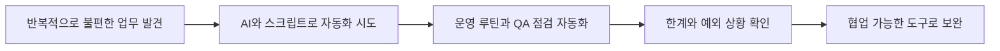

## 회고를 남기기 시작한 이유

올해부터는 의식적으로 회고를 남겨보려 한다. 늘 배우고 앞으로 나아가는 데 집중해 왔지만, 정작 내가 무엇을 보고 어떤 방식으로 일해 왔는지를 천천히 돌아본 적은 많지 않았다. 많지는 않더라도 월 단위로 꾸준히 기록을 남기면서, 생각의 흐름과 일하는 방식을 스스로 점검해 보고 싶다.

## 이번 분기의 키워드: AI를 어떻게 일에 연결할 것인가

2026년 1분기의 키워드는 단연 AI였다. 이미 익숙한 주제이기도 했지만, 실제로 여러 도구를 유료 버전까지 직접 써보면서 체감한 변화의 속도는 예상보다 훨씬 빨랐다. Claude, Google Pro, Stitch, Codex 같은 도구를 차례로 써 보니 이제 중요한 질문은 "AI가 얼마나 좋아졌는가"가 아니라 "이 재료를 지금의 프로덕트와 업무에 어떻게 연결할 것인가"에 더 가까워졌다.

돌이켜보면 나 역시 AI를 잘 활용하지 못한 쪽에 가까웠다. 기술이 빠르게 발전하는 것을 계속 지켜보면서도, 실제 업무 안에서 불편을 줄이는 방식으로 연결하는 시도는 충분하지 않았다. 그래서 이번 분기에는 거창한 시도보다도, 내가 매일 맞닥뜨리는 불편을 하나씩 해결하는 방향으로 접근했다.

## 반복 업무를 줄이기 위한 첫 시도

가장 먼저 손댄 것은 반복적으로 발생하는 운영성 업무였다. 배포 전후로 dev, stage, live 환경의 기본 접속 상태나 오류 여부를 확인하는 작업은 루틴하게 발생했고, 기획을 하다 보면 이런 점검 항목들이 자연스럽게 일감이 되곤 했다. 이 흐름을 자동화하기 위해 AutoQA 성격의 점검 스크립트를 만들었고, 반복 확인 작업을 사람이 일일이 기억하고 수행하는 방식에서 조금씩 분리해 보기 시작했다.

또 하나는 계정과 인증 정보를 다루는 반복 작업이었다. 매주 dev, stage, live 환경에 접속해 비밀번호를 변경해야 하는 운영 루틴이 있었는데, 이를 스크립트로 자동화했다. 개발자가 직접 처리해야 하는 단순 반복 작업을 줄여 주는 것만으로도 팀 전체의 피로도를 낮출 수 있다고 생각했다. 작은 자동화였지만, 실제 업무 흐름 안에서 체감되는 효용은 분명했다.

## 자동화의 한계와 협업의 필요

물론 한계도 분명했다. 내가 직접 제품 코드를 관리하는 역할은 아니기 때문에, 자동화 스크립트가 의존하는 화면 구조나 동작 방식이 바뀌면 다시 보완이 필요했다. 또한 미세한 보정이나 예외 처리는 아직 자동화만으로 안정적으로 해결하기 어려웠다. 이 지점에서 오히려 분명해진 것은, 자동화가 사람을 완전히 대체하는 것이 아니라 개발자와 협업할 수 있는 형태로 설계되어야 한다는 점이었다. 코드 레벨에서 충분히 검증된 뒤 현업에 연결되는 흐름이 더 현실적이라는 판단도 하게 됐다.

## 기술을 더 이해하게 된 분기

이 과정을 거치면서 자연스럽게 개발 지식에도 더 가까워졌다. Node.js, GitHub, API 같은 기본 개념을 실무 맥락에서 계속 접하다 보니, 더 이상 멀리 있는 단어가 아니게 됐다. 직접 구현해 보니 기술은 추상적인 학습 대상이 아니라, 문제를 더 잘 정의하고 해결하기 위한 언어에 가까웠다.

## 여전히 중요한 것은 도메인 이해

이번 분기에서 가장 의미 있게 느낀 지점은 따로 있었다. AI는 분명 많은 공통 지식을 빠르게 처리할 수 있지만, 지금 내가 속한 조직과 프로덕트의 미세한 맥락까지 단번에 이해하지는 못한다는 점이다. 어떤 문제가 진짜 문제인지, 무엇이 팀에 실제로 도움이 되는지, 어디서 사용자 경험이 자주 흔들리는지는 결국 현업 안에 있는 사람이 가장 잘 안다. 이 감각은 여전히 중요한 경쟁력이라고 느꼈다.

## 다음 분기에 이어갈 일

그래서 앞으로의 방향도 비교적 선명하다. AI를 단순히 새로운 도구로 소비하는 데서 그치지 않고, 실제 팀의 생산성을 높이는 작은 도구들로 계속 연결해 볼 생각이다. 특히 신규 입사자의 온보딩 과정이나 현업 실무자들이 동일한 기준선에서 일을 시작할 수 있도록 돕는 장치를 더 만들어 보고 싶다. 이미 일부는 GitHub에 정리해 두었고, 곧 실제 인원 온보딩 과정에서도 시험해 볼 계획이다.

## 마무리

이번 분기를 지나며 얻은 결론은 단순하다. AI는 누군가를 대체하는 존재라기보다, 문제를 더 잘 정의하고 더 빠르게 실행하게 만들어 주는 도구에 가깝다. 중요한 것은 도구 자체보다, 그것을 지금의 일에 어떤 방식으로 연결하느냐다. 다음 분기에도 업무 일상에서 반복되는 불편을 더 발견하고, 팀에 실질적으로 도움이 되는 형태로 하나씩 바꿔 나가고 싶다.
